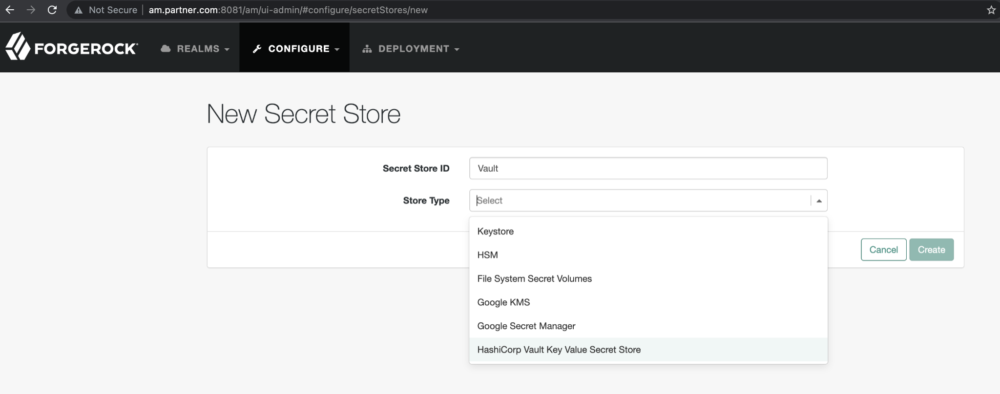
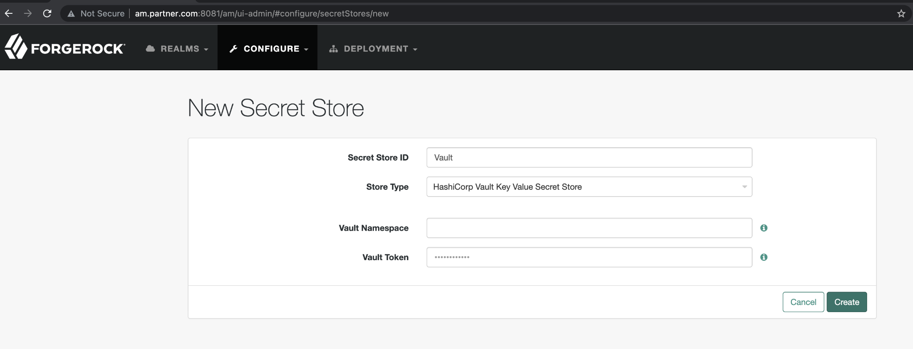
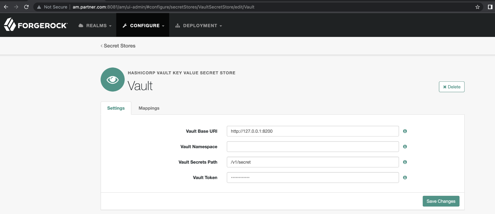
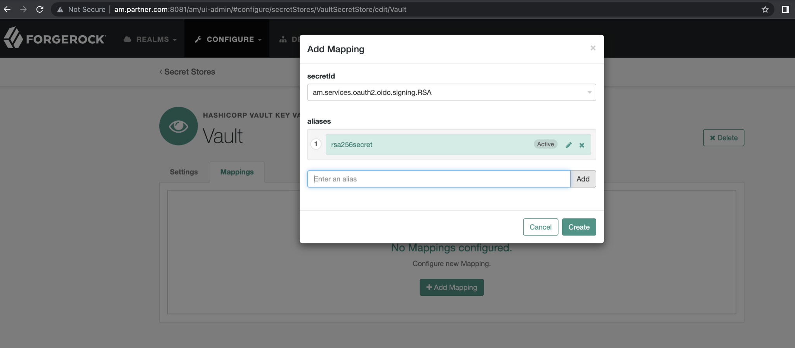
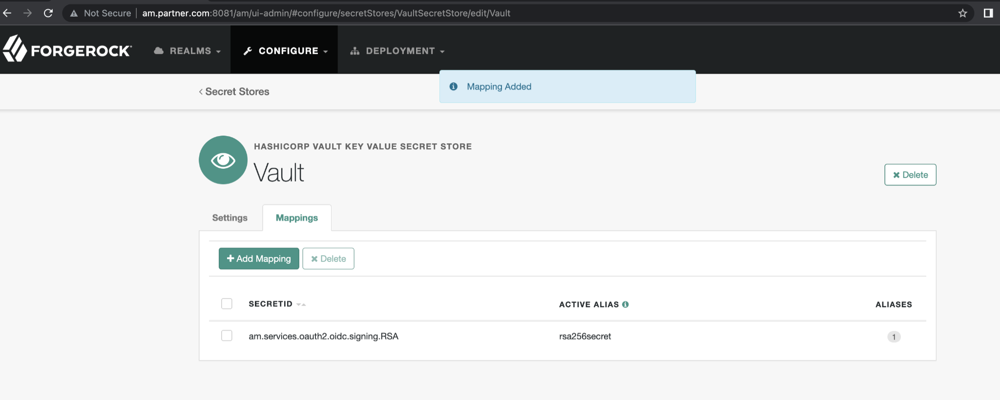

# HashiCorp Vault Key Value Secret Store

A simple authentication node for ForgeRock's [Identity Platform][forgerock_platform] 7.2.0 and above. This integration will allow users to choose HashiCorp Vault as a secret store for ForgeRock Access Management. Secrets can be stored in Vault, and ForgeRock Access Management can be configured to point to the Vault instance to pull these secrets. This will allow users to manage secrets using the HashiCorp vault.

## Configuring HashiCorp Vault Secret Store in ForgeRock

The first step is to install this integration into the environment that ForgeRock Access Management is installed in. The integration can be downloaded from the current releases here. Copy the jar file into the ../web-container/webapps/openam/WEB-INF/lib directory where ForgeRock Access Management is deployed. Restart the web container to pick up the new secret store.

The next step is to configure the secret store. HashiCorp Vault Secret Stores can be configured at a global and realm level:
* To create on a global level: Go to Configure > Secret Stores.
* To create on a realm level: Go to Realms > Realm Name > Secret Stores.
* Select Add Secret Store.
* Enter the Secret Store ID.
* From the Store Type drop-down list, select HashiCorp Vault Key Value Secret Store.
* Enter the Vault Namespace and Vault Token.
   
* Select Create.
   
* Verify configurations are correct
   

The next step is to create a mapping for the secret. Several AM features require the use of secrets for signing and encryption. For each requirement, AM has a secret ID. To provide AM with the required secret, map one or more aliases from the secret stores you configure to each of the secret IDs. These mappings allow you to choose which are the active aliases, and rotate them when they become expired or compromised.

To map alias in Vault Secret Store:
* To map secrets within a global secret store: Navigate to Configure > Secret Stores.
* To map secrets within a realm secret store: Navigate to Realms > Realm Name > Secret Stores.
* Select the store that contains the secrets you want to map.
* On the Mappings tab, select Add Mapping.
* From the Secret ID drop-down list, select the Secret ID that is to be associated with an alias.
* For information about the different secret ID mappings, see "Secret ID Default Mappings".
* Enter any Alias and click the add (+) icon. You can add as many aliases as necessary. The first alias in the list determines which alias is the active one. Active secrets are used for signature generation and encryption, while the non-active secrets are used for signature verification and decryption.
  
* Drag and drop to change the order of alias
* Once your mappings are complete, select Create.

ForgeRock access management will now use this configured secret store to retrieve the mapped secrets from Vault.
